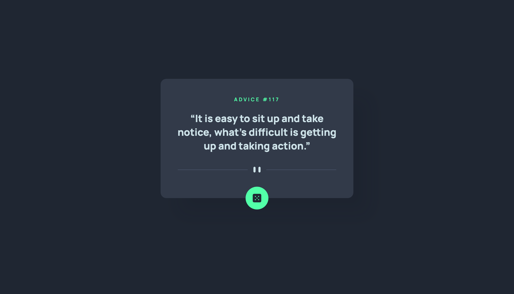

# Frontend Mentor - Advice generator app solution

This is a solution to the [Advice generator app challenge on Frontend Mentor](https://www.frontendmentor.io/challenges/advice-generator-app-QdUG-13db). Frontend Mentor challenges help you improve your coding skills by building realistic projects.

## Table of contents

- [Frontend Mentor - Advice generator app solution](#frontend-mentor---advice-generator-app-solution)
  - [Table of contents](#table-of-contents)
  - [Overview](#overview)
    - [The challenge](#the-challenge)
    - [Screenshot](#screenshot)
  - [My process](#my-process)
    - [Built with](#built-with)
  - [Author](#author)

## Overview

### The challenge

Users should be able to:

- View the optimal layout for the app depending on their device's screen size
- See hover states for all interactive elements on the page
- Generate a new piece of advice by clicking the dice icon

### Screenshot

### Links

- [Solution](https://www.frontendmentor.io/solutions/advice-generator-app-with-vue-3-typescript-and-axios-LMt3DIZC-y)
- [Live Site](https://skarline.github.io/advice-generator-app/)

## My process

### Built with

- [Vue.js](https://vuejs.org/)
- TypeScript

## Author

- Frontend Mentor - [@skarline](https://www.frontendmentor.io/profile/skarline)
